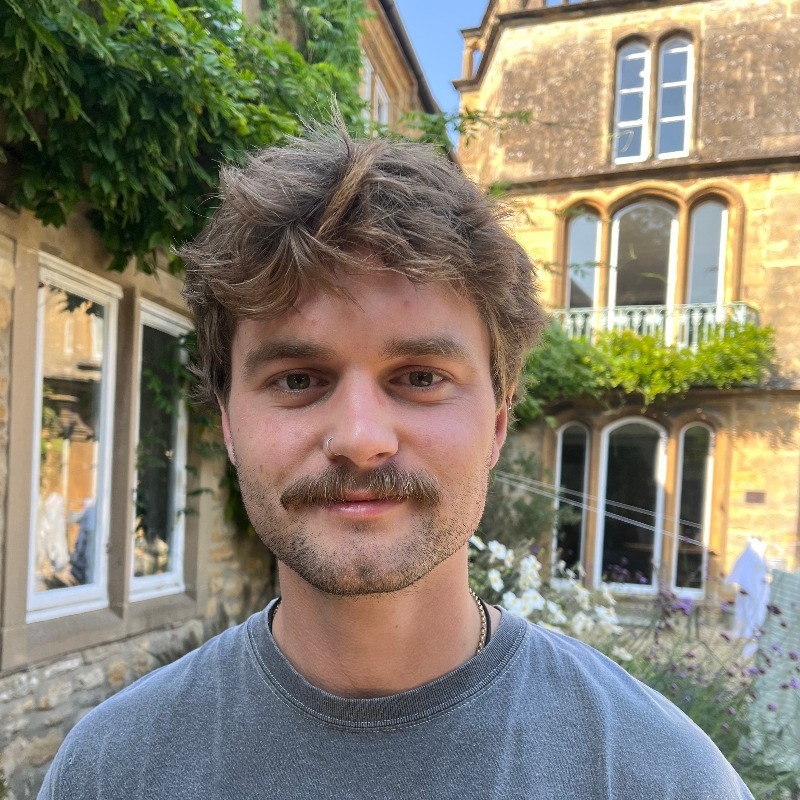

Hi! This is my personal webpage. I use it mainly for writing blog posts and book reviews, and for sharing these with friends. I love writing about the topics that fascinate me - it's a great way to clarify your own thoughts and track their changes over time. It's also nice to have a personal space where you can just write from the heart and not take things too seriously. So I'm clarifying from the get go that this blog is a pet-project, distinct from my formal work. Most of these ideas were hashed out at the pub.

That said, I'm incredibly fortunate that my career aligns so well with my interests. I have a background in physics and machine learning, and currently work as a data scientist in a systems neuroscience lab. My interests are broad but somehow feel completely unified, ranging across philosophy of mind, Buddhism, neuroscience and AI. So expect to read about these and other topics in my blog.

Any comments please don't hesitate to get in touch.
