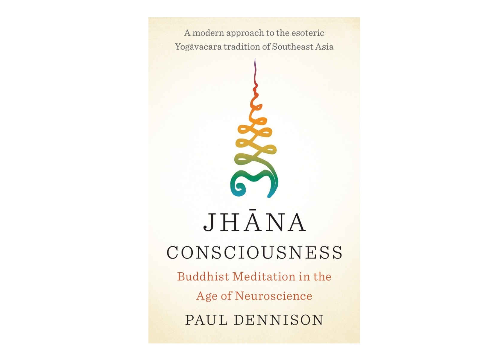

Like almost everyone else on the planet right now, I've been excitedly following the development of large language models (LLMs) like that ChatGPT. A friend recently showed me a [video](https://youtu.be/8dMOdz2rcSI?feature=shared&t=706) of Ilya Sutskever (the cofounder of OpenAI) explaining some of the major concepts underlying LLMs, and the belief that they present a path to the development of truly intelligent systems. The core idea is that *'text is a projection of the world'*. That is, that events in the world have all sorts of statistical relationships, and that these relationships are reflected in the statistics of text. People often disparagingly criticise LLMs of being simply next-token predictors that can mimic the text they are trained on. But what Ilya and other LLM proponents emphasise is that through having a good statistical understanding of text, LLMs must also have an understanding of the world this text refers to.

<iframe width="560" height="315" src="https://www.youtube.com/embed/8dMOdz2rcSI?si=Ix5aoCboBepKVl_Z&amp;start=707" title="YouTube video player" frameborder="0" allow="accelerometer; autoplay; clipboard-write; encrypted-media; gyroscope; picture-in-picture; web-share" allowfullscreen></iframe>

An example here can be useful. If I say 'I threw a ball in the air and it came back down and hit the ...', you might guess that the next word is 'ground'. An LLM could predict 'ground' simply on the basis of similar sentences it has been trained on, or alternatively, it could have learnt through its training some representation of the world which includes an understanding of gravity and how balls move, and the layout of the world, in which the ground is typically underneath things in the air. The latter case sounds much more like an intelligent system. A good world model enables LLMs to make sensible predictions of scenarios that it has never encountered in text before, which is a sure hallmark of true intelligence.

What the discussion here essentially comes down to is the relationship between symbols and semantics. That is, can everything in the world be mapped onto symbols that represent the world? If so, then LLMs could present a path to true intelligence.

This is by no means a new debate, but is a question that has plagued philosophers of language for generations. out of this long tradition, one work stands out as particularly relevant here: Wittgenstein's Tractatus. the Tractatus presents a rigorous analysis of how language acquires meaning in relation to the world. At its root, language consists of names, which mirroor objects in the world. One level up, we have elementary propositions, which are collections of names that mirror states of affairs in the world. And finally, we reach propositions, which are built out of elementary propositions, and mirror facts. This structure is commonly called 'picture theory'. At its root, the building blocks of language (names) have meaning purely through a mapping between those names and objects in the world. The rest of language consists of logical relationships between these building blocks, which exactly mirror the logical relationships between objects in the world.

We can see clearly how picture theory presents a basis for the development of LLMs. LLMs cannot see the mirroring between names and objects - they have, for example, no experience of the colour red. But the point is this doesn't matter - red is a logical atom which cannot be broken down and described any further. The task of a LLM is to learn the logical relationships between names, elementary propositions and propositions, through the language it is trained on, and through this it will learn exactly the logical relationship between objects, states of affairs, and facts in the world.

Wittgenstein goes on to examine, under this theory, what statements can be said to be meaningful. His answer is radical and narrow: only empirical statements have meaning. Nothing can be said about the world as a whole, and all of philosophy is the result of failing to grasp this point.

Tractatus-era Wittgenstein is commonly associated with the logical positivists, due to his close association with figures like Russell, Moore, and the Vienna Circle. They too shared a narrow definition of what statements are meaningful, based on the verification principle.

It is, however, a grave mischaracterisation to portray Tractatus-era Wittgenstein as belonging to this clan. People often emphasise the distinction between early and late Wittgenstein, which I think is overstated. Even in the Tractatus, Wittgenstein hints to a rich world lying beyond the limits of language. The content of the Tractatus is itself meaningless under its own definitions. Why on earth would someone write a text that is meaningless? It is because its purpose is in fact not in the realm of analytic philosophy at all: it is a journey that brings us as individuals to a place of deeper understanding. Wittgenstein compares it to a ladder that must be discarded once it has been climbed. This points to a form of understanding that lies beyond what can be said meaningfully in language. The Tractatus concludes: 'Whereof one cannot speak, thereof one must be silent'.

But for Wittgenstein, it is exactly that which lies beyond language that is truly of value. Questions of ethics and religion are meaningless - no philosophical progress can be made on them, yet they are exactly what gives life its meaning and richness. It is of utmost importance that we make a leap of faith to get beyond an understanding consisting purely of empirical facts. However, this leap
must be made alone: if it can't be communicated meaningfully, it can only be done internally. Language can be used in a more artistic sense to point the way, but it will only make sense as we ourselves make the necessary jumps.

There is a striking similarity here with Buddhist practice. The Buddha famously rejected many philosophical questions, and instead encouraged his followers simply to practice. In his book Jhana Consciousness: Buddhist Meditation in the Age of Neuroscience', Paul Dennison gives a beautiful description of the Buddhist path. Our everyday waking consciousness is permeated by language: we all experience a constant voice in our heads describing all of our experiences as they happen. The Buddha presented a precise training program to step outside of this everyday waking consciousness. Through years of mindfulness and meditation, one can cultivate states known as the Jhanas, in which all internal voices cease. These states are completely outside of the realm of description, and therefore can only be understood through direct experience. Their purpose is to develop true insight into the nature of the world. Insight differs from knowledge in that it lies beyond language and therefore cannot be shared. It is, in a sense, devoid of internal structure, but consists of atoms that come to us in a flash. And it is insight that really matters. Attempts to put insight into language are doomed to fail, and therefore language acts only as a barrier to insight. This is why we must cultivate states outside language, in which we can patiently wait for these flashes to come to us.

This, to me, is fundamentally why I don't find the discussion around LLMs and other forms of AI particularly satisfying. While it is true that LLMs can learn valid models of empirical facts in the world, and in this sense are intelligent, the stuff that actually matters is probably missing.

I want to quickly clarify that I am using language as a particular example of a representation of the world, but that all of these discussions do in fact apply to *any* representation. In neuroscience, we model how information about the world, entering our nervous system through the senses, gets processed to form compressed representations of the world, manifested in patterns of neural activity. Much neuroscience research revolves around studying how relationships between different internal representations reflect relationship between states in the world: a very Wittgensteinian research program. These representations are multi-modal, in that they reflect the fact that we receive information through a multitude of different senses. In everyday waking consciousness, we experience these representations as sounds, images, language, and other modalities. Sometimes they are very closely tethered to our senses, in which case we take them to be actual experiences of the world. Other times they take on a more dreamy or hallucinatory quality, reflecting experiences of the world we are not currently having (in Buddhism this is called 'mind', which is seen as an additional sense). And one of the things that makes Jhana consciousness impossible to talk about is that it lies beyond any representation of the external world - it is a state 'excluded from the senses'.

Often it is argued that the problem with LLMs is that language is not a rich enough representation of the world. Truly intelligent AI systems must have vision, we are told, so that names in language can point to visual objects outside language. Or they must be embodied in 3D space, or any other host of new sensory modalities that can lead to richer internal representations of the world. But ultimately, any new sensory modality, any new internal representation, can, by definition, only reflect empirical facts about the world. And while this can lead to 'intelligent' systems, it completely misses the point about what actually matters to us as humans. And what actually matters is not an empirical fact, it does not exist as a representation, but is still somehow experienced in every waking moment as an indescribable and indispensible sense of value underpinning all experience, to be clarified and made obvious through the cultivation of the Jhanas, or any other path to insight.

Where on earth can we go from here? It seems like I have dived headfirst into the realm of mysticism. We're in a tricky position: it seems like we're making the grave mistake of trying to talk about that which we have said we cannot talk about. Once again, Wittgenstein can point us in the right direction: let's talk about that which is meaningful: empirical questions.

The framework in which neuroscience currently operates is a very rich and useful one. The brain is a Turing machine, so all of its operations are computable, and can be studied and simulated. Anything outside of this framework delves into Cartesian dualism and other forms of meaningless discussion. Therefore any facts about our experience of the world can all be mapped back into this empirical framework. We can study their neural underpinnings, and how they modify behaviour. This includes that which internally takes a leap outside the realm of meaning: externally, this leap is still just a neural process.

Can we study the Buddhist program of cultivating the Jhanas through such an empirical program? This is exactly what Paul Dennison discusses in his book. He has spent years performing EEG recordings on experienced Jhana meditators. I believe that elucidating the neural underpinnings of Jhana and insight is some of the most important and worthy research that can be undertaken in this field. His findings are truly extraordinary - it is very clear that the Jhanas are extremely unusual brain states, and it is no surprise that they can feel so profound from the inside and lead to redical changes in a practitionaer's life. However, studying them empirically will still never enable us to take the leap ourselves, but can lead to knowledge and curiosity that can push us to practise. This research is therefore much like Wittgenstein's ladder, but perhaps turned on its head: a series of meaningful empirical statements that can help carry us to the important realm that lies beyond meaning.

This in fact reflects my feelings about science as a pursuit more broadly. The importance of empirical questions can't exist within the empirical world at all. It is not empirical understanding, or new technological developments, that really matter, but rather what the act of actually doing science can do to us as individuals. Feelings of awe, and the experience of beauty, are what gives science its value. For only these experiences can guide us towards that realm that lies beyond all possible scientific questions.

My conclusion at this stage of my life with regards to all of this is therefore quite simple: what is meaningful is empirical research in neuroscience and AI; what matters is getting our bums on our meditation cushions and practicing.

